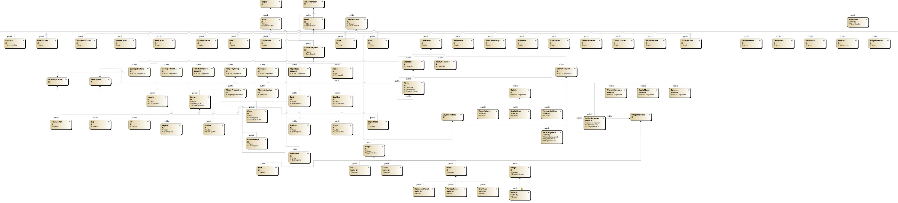

# SilkSong
### 项目简介


这是一个用 EasyX 和 Windows API （GDI、DirectShow）复刻的一款官方还未发售的 2D 横板类银河恶魔城游戏——《丝之歌》，开发语言是 C++。人物素材对标《丝之歌》，而由于缺乏专业美术，部分场景素材用的还是《空洞骑士》。

项目分为两个部分：Engine 和 Project。

Engine（仅适用于开发简易 2D 游戏） 部分有渲染系统、粒子系统、碰撞系统、物理模拟系统、媒体系统、动画系统、相机系统、键鼠交互系统、UI 系统、计时系统等等。整体设计理念有借鉴一些主流工业级引擎（如UE、Unity）。Engine 部分与游戏具体内容无关。Project 部分则是开发者需要具体编写的有关游戏内容的部分。

### 基本概念

项目大致类关系树如下（由于类过多，该图仅展示约50%）：



游戏程序有一个全局对象——游戏世界（**World**），游戏世界中有诸多容器来存储并组织一切各具代表意义的对象类（如所有游戏对象，所有可渲染物体，所有碰撞体，所有计时器等等等）。开发者可以定义多个场景关卡（**Level**），但一个世界同时只能运行一个**Level**，开发者需要在 **Level** 中组织管理游戏对象（**Actor**），在 **Actor** 游戏对象身上管理各具功能的组件（**ActorComponent**）。

每个 **Level** 有且仅有一个特殊的 **Actor**——**Controller**。它是玩家控制器，你可以派生此类并自定义键鼠交互映射规则                                    （在重载的虚函数 *SetupInputComponent* 当中）。

```C++
void Player::SetupInputComponent(InputComponent* inputComponent)
{
	inputComponent->SetMapping("WalkLeft", EKeyCode::VK_A);
	//......
    
    inputComponent->BindAction("WalkLeft", EInputType::Holding, [this]() 
	{
		//......
	});
	//......
}
```

在每个 **Level** 中，你需要在构造函数中通过 *SetDefaultController* 函数指定该场景的默认 **Controller**，否则，程序将会给你自动指定一个毫无任何功能的原始 **Controller**。

```C++
MossGrottoLevel::MossGrottoLevel()
{
	SetDefaultController<Player>();
	//......
}
```

**Character** 则是更为特殊的 **Controller**，它是专门的横板  2D 跳跃游戏的玩家角色，此类中提供了一些已经实现好的角色交互和运动逻辑，开发者如若要制作 2D 横板跳跃游戏，派生它再合适不过了。

开发者大多数时间都要自定义具体的 **Actor** 和 **ActorComponent** 来实现游戏业务逻辑，或是搭建 **Level** 场景，或是实现 UI 界面（**UserInterface**），而它们都属于 **Object** 类。每个 **Object** 类都有三种特殊函数——*BeginPlay、Update、EndPlay*。*BeginPlay* 用来定义一些游戏对象的开始逻辑（注意不是创建组件的初始化逻辑，创建组件最好在构造函数就进行），该函数会在构造函数执行后紧接着执行（但不是立刻，程序逻辑上并未紧挨，这两个执行节点之间还会处理一些其它逻辑，只是他们的执行间隔小于一个游戏循环帧而已）。*Update* 则会每一个游戏逻辑循环帧执行，此外它会被传入一个参数 deltaTime 来得知此次循环和上一个循环之间的时间间隔供开发者使用，以便于消除实时帧率的波动对部分游戏逻辑的影响（如运动学层面等等），总之开发者在该类函数中编写游戏业务逻辑再合适不过了。*EndPlay* 函数则适合编写一些对象销毁逻辑，比如游戏对象的亡语。注意，开发者禁止自定义析构函数，而是用 *EndPlay* 来代替，否则会出现一些冲突性的 bug。以上三个函数均需采用装饰者模式来重载，需要先执行父类虚函数再定义自己的逻辑，否则会丧失一些核心功能。

```C++
void Player::Update(float deltaTime)
{
	Character::Update(deltaTime); 
    //开发者自定义逻辑......
}
```


**Actor** 是开发者大多数时间要去定义的类。开发者需要在构造函数中创建并绑定组件：

```C++
XXX::XXX()
{
	render = ConstructComponent<SpriteRenderer>();
	render->AttachTo(root);
	rigid = ConstructComponent<RigidBody>();
	//......
}
```

每个 **Actor** 有一个默认的 root 场景根组件（**SceneComponent**），它使得 **Actor** 具有了场景属性——即 **Transform** 类，该类包含了位置坐标（location）、旋转（rotation）以及缩放（scale）。我们通过 *ConstructComponent* 函数来创建组件，该函数会创建一个 **ActorComponent** 组件类并将其注册到 **Actor** 容器当中。如果组件是场景组件的派生类，则需通过 *AttachTo* 函数来绑定到指定组件上，该函数可以设置场景组件之间的父子关系，方便通过相对场景属性来计算最终的绝对场景属性（在世界的场景属性），一般最好绑定到 root 上。

```C++
void AttachTo(Actor* par, FAttachmentTransformRules rule = FAttachmentTransformRules::KeepRelativeTransform);

template<typename T>
T* ConstructComponent();
```

如果想要销毁某个 **Actor** 对象，可以直接调用 *Destroy* 函数：

```C++
void Destroy();
```

该函数会将该 **Actor** 加入待销毁容器当中，在本次逻辑循环帧的某个时刻统一销毁。当然，**Actor** 的默认析构函数已经包含了对其身上注册的所有组件的销毁逻辑。

在有关设置或者获取 **Actor** 的场景属性方面，我提供了一系列函数接口，相信大家看名字也能知道它的功能：

```C++
	/** 获取场景属性（相对父对象坐标系）**/
	const FVector2D& GetLocalPosition() const;
	float GetLocalRotation() const;
	const FVector2D& GetLocalScale() const;
	const FTransform& GetLocalTransform() const;

	/** 获取场景属性（世界绝对坐标系）**/
	FVector2D GetWorldPosition()const;
	float GetWorldRotation()const;
	FVector2D GetWorldScale()const;

	/** 设置场景属性（相对父对象坐标系，如若没有父对象则为世界绝对坐标系）**/
	void SetLocalPosition(const FVector2D& pos);
	void SetLocalRotation(float angle);
	void SetLocalScale(const FVector2D& scale);
	void SetPositionAndRotation(const FVector2D& pos, float angle);
	void SetLocalTransform(const FTransform& transform);

	/** 增加场景属性偏移量 **/
	void AddPosition(FVector2D pos);
	void AddRotation(float rot);
```

其中 *GetWorldPosition*、*GetWorldRotation*、*GetWorldScale* 这三个函数是通过递归来计算某个 **Actor** 的世界绝对场景属性的，例如：

```C++
float Actor::GetWorldRotation() const
{
	if (parent && transformRule.RotationRule == EAttachmentRule::KeepRelative)
	{
		return parent->GetWorldRotation() + GetLocalRotation();
	}
	else return GetLocalRotation();
}

FVector2D Actor::GetWorldScale() const
{
	if (parent && transformRule.ScaleRule == EAttachmentRule::KeepRelative)
	{
		return parent->GetWorldScale() * GetLocalScale();
	}
	else return GetLocalScale();
}
```

*GetWorldPosition* 会复杂些，因为它还受父类对象在世界坐标系下的 rotation 和 scale 的影响：

```C++
FVector2D Actor::GetWorldPosition() const
{
	if (parent && transformRule.LocationRule == EAttachmentRule::KeepRelative)
	{
		return parent->GetWorldPosition() + FVector2D::RotateVector
            (parent->GetWorldRotation(), GetLocalPosition() * parent->GetWorldScale());
	}
	else return GetLocalPosition();
}
```


**GameplayStatics** 是一个静态类，其中定义了一系列最常用的静态函数供开发者使用，如创建游戏对象 *CreateObject*， 查找某类游戏对象 *FindObjectOfClass*， 查找带有某个标签名的对象 *FindObjectOfName*创建 UI 界面 *CreateUI*，跳转到新的关卡场景 *OpenLevel* 等等等。其中 *CreateObject* 大概是使用频率最频繁的函数之一了：

```C++
template<typename T>
static T* CreateObject(FVector2D pos = FVector2D::ZeroVector, float angle = 0, FVector2D scale = FVector2D::UnitVector);
```

```C++
GameplayStatics::CreateObject<MossFloor>({ 1390.f, 1245.f });
```


**Timer** 是计时器，可以绑定目标函数回调，指定其执行间隔。同时，开发者也可以决定该函数回调是一次性还是永久，如果是永久，同样可以指定从绑定函数开始到其初次执行的时间间隔。绑定需要通过 **Timer** 类的 *Bind* 函数，该计时器将会被注册到世界计时器容器统一管理。

```C++
template<typename T>
void Bind(double delay, T* obj, void(T::* function)(), bool repeat = false, double firstDelay = -1.0)

void Bind(double delay, std::function<void()>function, bool repeat = false, double firstDelay = -1.0);
```

使用方法如下：

```C++
MyTimer.Bind(3.f, [this]() {
	//......
}, true, 0.5f);
```

Engine 部分一共 10106 行代码，几乎涵盖了大多数轻量级 2D 游戏开发所需实现的功能（图像渲染、相机处理、图像处理、帧动画、音视频播放、物理模拟与碰撞检测、UI 界面、粒子特效、键鼠控制、计时器、事件系统、文件读写、场景切换管理等等）。由于篇幅问题，以上仅介绍了游戏开发者可能最常用的几种函数或是接触的类。其余各具功能的组件、UI 部件等等的功能和使用方法请参照具体代码注释。

### 开发环境


VS2022 + EasyX_20240601 

### 素材来源


大部分美术、音效皆来自[https://www.spriters-resource.com/search/?q=Hollow+Knight](http://)或原版解包，小部分来自网上各种民间版《丝之歌》以及《空洞骑士》 wiki 百科网站，其余皆为作者手绘，或是用ps精修。

所有素材皆用作学习交流，严禁商用。

### 游戏简介

目前只还原了两种可相互切换的菜单场景、两个二代“苔藓洞穴”的场景、三个一代“泪水之城”的场景、一个一代“格林剧团”的场景、两种小怪以及两场经典 boss 战。但主角的几乎所有行为、技能均已还原。

菜单“CHANGE THEME”可以在怀旧和最新场景间来回切换。怀旧场景会直接进入一代的“泪水之城”，而新版场景会进入二代“苔藓洞穴”。在“苔藓洞穴”死后会复活在“泪水之城”。

游戏中 WASD 控制上下左右，按住 Space 空格疾跑，J 攻击，K 跳跃（按住时间越久跳得越高，跳跃到平台边沿会自动攀爬），F 冲刺（地面小冲刺，空中大冲刺），L 闪避，Q 飞镖（飞镖可互动，向下攻击用作垫脚石），E 治疗，I 近战技能，地面使用 O 为远程技能，空中使用 O 发射钩锁斜向上移动，U 快速突刺技能。特别的，长按 W/S 向上/下看，W+J 向上攻击，S+J 斜向下攻击，座位旁按 W 坐下，坐下以后按 S 起立，按下 X 消耗灵魂可触发一次短时间格挡，格挡成功会有回报和反击。

当然，以上键位玩家均可根据自己偏好自定义。

### 游戏执行效果


演示视频：【【EasyX/C++】| 《丝之歌》实机抢先体验（确信）】 https://www.bilibili.com/video/BV1t288ztE6K/?share_source=copy_web&vd_source=a59fee9f89e8975f2e92a9b950cce6c5

